# Reality | Check

Reality Check is your one stop destination for getting all the different tech realities explained in just one page! Our goal is to create a visually appealing and simple summary to clarify what VR, AR and MR is all about with pictures, videos and explanatory texts as aid. We target people that does not have much prior knowledge of the subject at hand but are interested in learning more and has a tech-scene and interest. Since we are conducting weekly meet-ups we try to encourage as many people to join us as possible through our contact form at the end of the page.

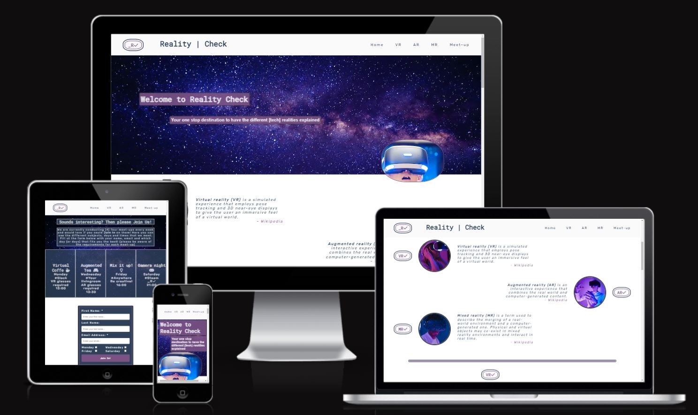

[Check out the website here!](https://kristofergab.github.io/reality-check/)

## CONTENTS
---
* [User Experience](#user-experience)
  * [Initial Discussion](#initial-discussion)
  * [User Stories](#user-stories)
* [Design](#design)
  * [Color Scheme](#color-scheme)
  * [Typography](#typography)
  * [Imagery](#imagery)
  * [Wireframes](#wireframes)
* [Features](#features)
  * [General Features](#general-features)
  * [Features Left To Implement](#features-left-to-implement)
  * [Accessibility](#accessibility)
* [Technologies Used](#technologies-used)
  * [Languages Used](#languages-used)
  * [Frameworks & Programs Used](#frameworks-&-programs-used)
* [Deployment](#deployment)
* [Testing](#testing)
  * [Validator Testing](#validator-testing)
  * [Known Bugs](#known-bugs)
  * [Unfixed Bugs](#unfixed-bugs)
  * [User Stories Testing](#user-stories-testing)
  * [Full Testing](#full-testing)
* [Credits](#credits)
  * [Content](#content)
  * [Media](#media)
---
---

## User Experience (UX)
---
### Initial Discussion
Reality Check is an informative website that aims at increasing the understanding and awareness of the different tech realities available today. By utilizing different ways to get the information out by text and video the aim of the owners is to get more and more people to sign up to the different meet-up times and socialize and exchange knowledge and experience in the different fields.

### User Stories

#### Client Goals

- To get the information about VR, AR and MR out to the public.
- To ensure that this information is available:
  - for people absorbing information through different senses.
  - for different devices and screen sizes.
- To get more people to join in on their meet-ups through signing up through the site.

#### First Time Visitor Goals

- I want to get easy and quick information about a field that interests me.
- I want to understand what Reality Check is all about.
- I want to easily navigate through the page and find the information that I like.

#### Returning Visitor Goals

- I want to have the possibility to further my reading through other sources.
- I want to be able to see up-to-date information on the meet-ups that I would like to join.
- I want to join in on the meet-ups that interests me.

## Design
---
### Color Scheme

The color scheme was chosen by using the eye dropper tool from Chrome dev-tools on the hero image. Since the image was chosen first the theme was built around this color palettes. 

It was checked on [mycolor.space](https://mycolor.space/?hex=%232E4159&sub=1) to ensure that the gradients where matching. Also some #hex colors where taken from the Love Running project delivered by Code Institute (off-white and dark-grey). 

### Typography

Google Fonts was used for the chosen fonts to create a modern tech look:
- Roboto Mono is used as headings and for the form submit button
- Rubik is used for all other text in the body
- Sans-serif is the backup font
[Fontpair](https://www.fontpair.co/all) was used to find a good font pairing with Roboto Mono.

### Imagery
All images was taken from [Pexels](https://www.pexels.com/) free library and all pictures used are credited bellow with the name of the kind photographers that share their work for free. 

### Wireframes

Wireframes were created using the program Balsamiq for desktop use.

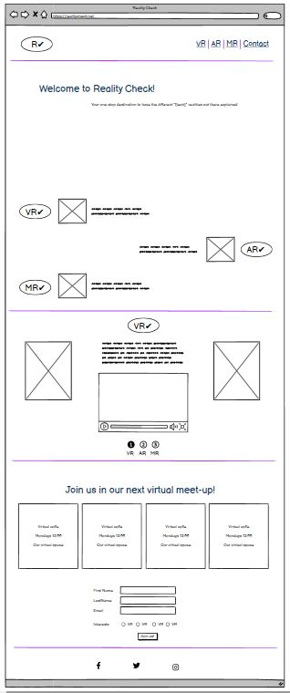

## Features 
---
We have included several features in this one-page website about the different tech realities out there. These features will be categorized in separate titles to enhance its intended use and functions.

### General Features

- __Navigation Bar__

  - This navigation bar is fixed at the top of the page and is fully responsive for different screens and will make sure to follow you along as you read through the sites information. It will help link you through the sites different sections Home VR AR MR and of course the Meet-up section.

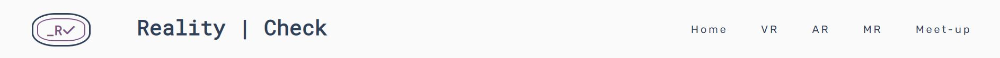

- __The landing page__

  - The landing page is welcoming you with a text explaining what the site is all about including a visually appealing picture of the universe and an image of a child in awe using a VR-headset to strengthen what the sites is for.
  - This section sets the atmosphere and mood through design and images that follow through the rest of the site.

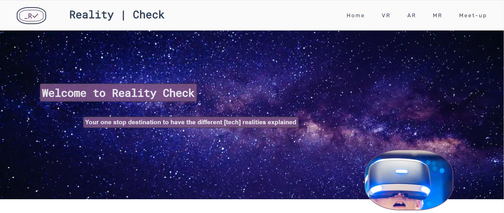

- __Summary Section__

  - This section is a short summary of the three main pillars VR, AR and MR that includes a small image and a text that summarizes, with few words, describes their meaning and use.
  - This will ensure to catch the users interest and they will easier find which if these categories (if not all) that they wish to continue to read and learn more about. Links are also included to wiki for further reading should this be of interest.

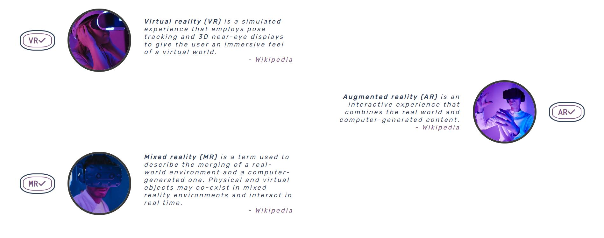

- __Detailed Section__

  - This section goes into more detail about each category with more text that explains its use and purpose. A video is also included for users that are more into visual learning than reading. is a short summary of the three main pillars VR, AR and MR that includes a small image and a text that summarizes, with few words, describes their meaning and use.
  - This is also where the links in the navigations bar will take you.
  - These three detailed sections will ensure to further extend users interest and knowledge about the subjects.
 
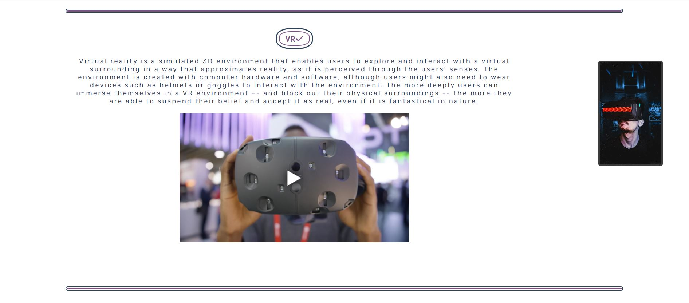

- __Meet-up section__

  - This section will allow the user to see exactly when the meet-ups will take place, if there are any requirements for that particular day and where they will be held. 
  - This section will be updated as these times change to keep the user up to date. 

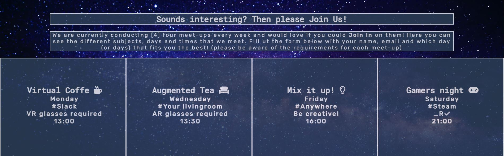

- __Join-In form section__

  - This form is connected to and followed right after the meet-up section to make it fast and simple for interested users to sign up for the different days and topics that fits them. The user will be asked to fill out their name, last name, email address and what days they would like to Join In on.

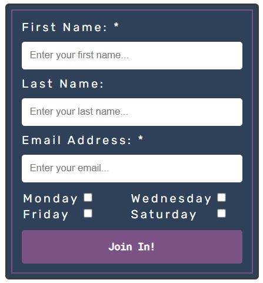

- __The Footer__ 

  - The footer section includes links to the relevant social media sites for Reality | Check. The links will open to a new tab to allow easy navigation for the user. 
  - The footer is valuable to the user as it encourages them to keep connected via social media.

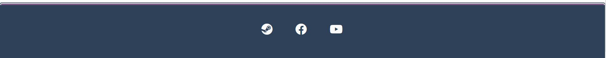

### Features Left to Implement

- The detailed section shall in the future be located at the same space on the site with the JavaScript functionality to change information with radio-button choices instead of having to scroll further down.

### Accessibility

During the development process the accessibility has been considered througout to ensure that it is user friendly for everyone. Constant checks has been made with the Chrome Dev tool Lighthouse to ensure this by:
- Using aria-labels for iframes.
- Using alternative descriptive attributes for all images used.
- Hide FontAwesome on icons that are not important for screenreaders to read.
- Ensuring sufficient contrast throughout the color schemes.
- Fixing navbar at top of screen so that it is always possible to find the right information.

## Technologies Used
---
### Languages Used

In this project HTML and CSS were used to create this site.

### Frameworks & Programs Used

Balsamiq - Used to create wireframe.

Git - For version control.

Github - To save and store the files for the website.

Google Fonts - To import the fonts used on the website.

Font Awesome - For the icons on the website.

Google Dev Tools - To troubleshoot and test features, solve issues with responsiveness and styling.

Google Dev Tools Lighthouse - For performance, accessibility, Best Practices and SEO

Pexels - For downloading and sizing images used.

Cloudconvert - to convert jpg to webp format.

Favicon.io To create favicon.

Am I Responsive? - To show the website image on a range of devices.

## Deployment
---
- The site was deployed to GitHub pages. The steps to deploy are as follows: 
  1.  In the GitHub repository, navigate to the Settings tab 
  2.  From the source section drop-down menu, select the main Branch
  3.  Once the main branch has been selected, the page will be automatically refreshed with a detailed ribbon display to indicate the successful deployment. 

The live link can be found here - https://kristofergab.github.io/reality-check/ 

## __Testing__ 
---
This website is built for Desktop viewing in mind and is therefor optimized for this purpose. Testing has been done during the developments different stages with lighthouse as a main resource to ensure the best performance possible at the same time as accessibility and best practices are followed and adhered to. Chrome dev-tools was the main source for designing the site where the Inspect window was constantly being observed to ensure the intended results. 

This is the final result for the deployed website:
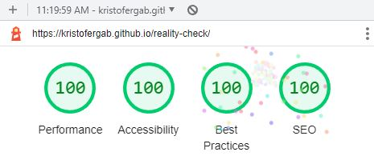

In the beginning the results on performance was very poor. Around 75% was all it could muster and a lot of editing where made to ensure that this reached 100%. Some changes made to reach this:
- Lazy loading images
- Resizing images that were to large.
- Change format from jpg to webp.
- Lazy load iframes
- Change iframes to only load on click and instead just show an image of the video

While desktop was the focus for the build, media queries have been added to make sure that it works on other devices as well, such as tablet and mobile. Due to the fixed navbar, detailed section, summary section, and to ensure high UX on different sized devices, as many as seven media queries were made. It works end responds well on different sizes but is not intended do be used on small mobile devices primarily.

Even if the function is there on mobile devices it loses its performance, mostly due to image sizes optimized for desktop as can be seen on the image below. Also SEO is slightly less because of the small size on the checkboxes on the form.

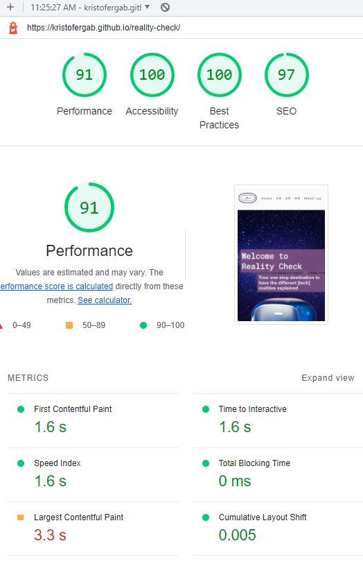

### Validator Testing 

This one page site has been run through the W3C validator for HTML and the Jigsaw validator for CSS.

- HTML
  - No errors were returned when passing through the official [W3C validator](https://validator.w3.org/nu/?showsource=yes&doc=https%3A%2F%2Fkristofergab.github.io%2Freality-check%2F)
- CSS
  - No errors were found when passing through the official [W3C (Jigsaw) validator](http://jigsaw.w3.org/css-validator/validator?lang=en&profile=css3svg&uri=https%3A%2F%2Fkristofergab.github.io%2Freality-check%2F&usermedium=all&vextwarning=&warning=1)

### Known Bugs

After testing on Safari a few bugs were discovered:
- The sites logos inner radius is squared instead of round. This is because the css command outline is not yet released.
- When rotating the scaling of the detailed section is not correct and the iframes overlap underlying section.

### Unfixed Bugs

Issues mentioned under Known Bugs section related to Safari is yet to be fixed. The outline issue is deemed acceptable. However, the overlapping issue is something that has to be handled in future release but accepted for now since it is fully functional in normal reading mode (not rotated).

### User Stories Testing

- __First Time Visitors__
  - *I want to get easy and quick information about a field that interests me.* The Summary section is perfect for newcomers to get a quick glance at the information and to decide on further reading.

  - *I want to understand what Reality Check is all about.* Landing page with welcoming text in combination with the summary section helps clarify this smoothly.

  - *I want to easily navigate through the page and find the information that I like.* The fixed navbar is the key here which simplifies navigating throughout the websites different sections.

- __Returning Visitors__
  - *I want to have the possibility to further my reading through other sources.* The included links from the summary section to wikipedia in combination of the iframe youtube videos in the detailed section is ensuring that other sources are incorporated.

  - *I want to be able to see up-to-date information on the meet-ups that I would like to join.* The meet-up section ensures that users are able to easily pick up this information and note down what fits them most.

  - *I want to join in on the meet-ups that interests me.* The userform in connection to the meet-up section helps the users to easily join in on the meetings that fits their need and want to participate in. Clear requirements exist to ensure good UX and there are required fields in the form to make sure that the right information gets sent to the host.

### Full Testing

The website has been test on multiple devices with different screen sizes and resolutions, using multiple different browser to ensure functionality and to find any potential bugs.

Devices tested on:
- Desktop Display hp 24" screen
- Large laptop with 20" screen
- iPhone 11 Pro
- Huawei P20 Pro
- iPhone SE
- iPhone 8
- iPad Air 2

Browsers tested on:
- Chrome
- Edge
- Firefox
- Safari

Functionality tests:
- All links have been tested for internal linking within the site and verified so that it takes the user to the correct section. All links work as expected.
- The links to external websites has also been tested and they all open in a new tab and takes you to intended webpage, both for wikipedia links and for footer links.
- All iframe videos play the intended content in the detailed section and is possible to start & stop as intended and can also be opened in new tab if larger viewing window is desired.
- The form has been checked so that it is not possible to "Join In" without filling in the required fields - Name and email. The email input checks and makes sure that it is a valid address. The checkmarks can be filled in or left out according to the user wishes.

## Credits 
---

### Content 

In this section all the webpages that were used as help for the development of this site will be listed. First the link to the website will be presented and then the information what the site was used for explained right after the link.

https://www.w3schools.com/css/css3_images.asp
https://www.w3schools.com/css/css3_object-fit.asp
https://www.w3schools.com/css/css_align.asp
for images

https://stackoverflow.com/questions/52037809/add-alpha-channel-to-hex-color-declared-on-css-variable
for opacity on hex

https://blog.logrocket.com/how-create-double-border-css/
https://developer.mozilla.org/en-US/docs/Web/CSS/border
for double borders

https://www.freecodecamp.org/news/how-to-center-anything-with-css-align-a-div-text-and-more/
for centering div content

https://stackoverflow.com/questions/36337086/my-youtube-video-wont-show-in-iframe
for embedding youtube

https://www.w3schools.com/howto/tryit.asp?filename=tryhow_css_stacked_form
for styling forms

Love Running project
for Times section - copy and modify code for meet up,
and for placement of FA script

https://css-tricks.com/fixed-headers-on-page-links-and-overlapping-content-oh-my/
for fixing fixed navbar scrolldown problem

https://developer.mozilla.org/en-US/docs/Web/Performance/Lazy_loading
for lazy loading

https://fontawesome.com/v4/accessibility/
for area-hidden

https://css-tricks.com/lazy-load-embedded-youtube-videos/
for srcdoc on iframe
Code copied:
`srcdoc="<a href=https://www.youtube.com/embed/Y8Wp3dafaMQ?autoplay=1>▶</a>"`

https://www.w3schools.com/Css/css3_mediaqueries_ex.asp
for hiding img on media query

https://cloudconvert.com/jpg-to-webp
for converting jpg to webp

http://zuga.net/articles/html-heading-elements/
for h3 size in rem

https://www.w3schools.com/css/tryit.asp?filename=trycss_css_image_overlay_opacity
for img hover overlay
copied style code and modified

https://stackoverflow.com/questions/1818249/form-with-no-action-and-where-enter-does-not-reload-page
for form without action javascript
javascript:void(0)

https://medium.com/@aurelien.delogu/401-error-on-a-webmanifest-file-cb9e3678b9f3
for crossreference on favicons to remove 401 error

- The text for the Summary section was taken from Wikipedia:
https://en.wikipedia.org/wiki/Virtual_reality
https://en.wikipedia.org/wiki/Augmented_reality
https://en.wikipedia.org/wiki/Mixed_reality

- The text for the Detailed section was taken from an article written by Robert Sheldon
https://www.techtarget.com/whatis/definition/virtual-reality
for text description in detailed section

- The icons used on the site were all taken from [Font Awesome](https://fontawesome.com/)

### Media

- All images used on the website are from the open source site https://www.pexels.com/ and extra credit given to the photographers kind enough to let us use these images for free:
- Ali Pazani
- Harsch Shivam
- Jessica Lewis Creative
- Michelangelo Buonarroti
- Miriam Espacio
- Moose Photos
- Shvets Production
- Tima Miroshnichenko

Links to Youtube videos used:
[Virtual reality](https://www.youtube.com/watch?v=i4Zt3JZejbg)
[Augmented reality](https://www.youtube.com/watch?v=WxzcD04rwc8&t=2s)
[Mixed reality](https://www.youtube.com/watch?v=uVAVSMyjWRg)
