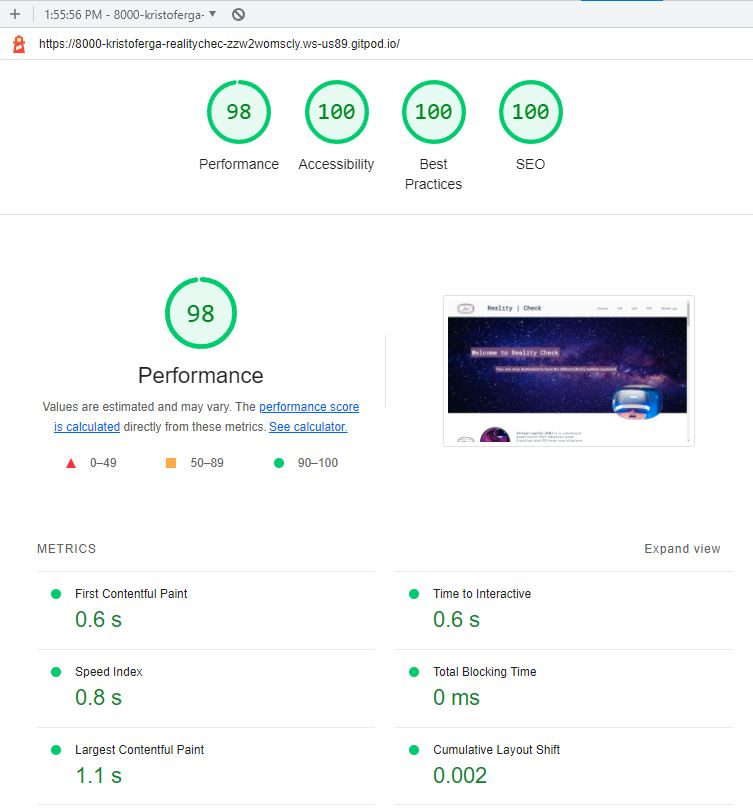
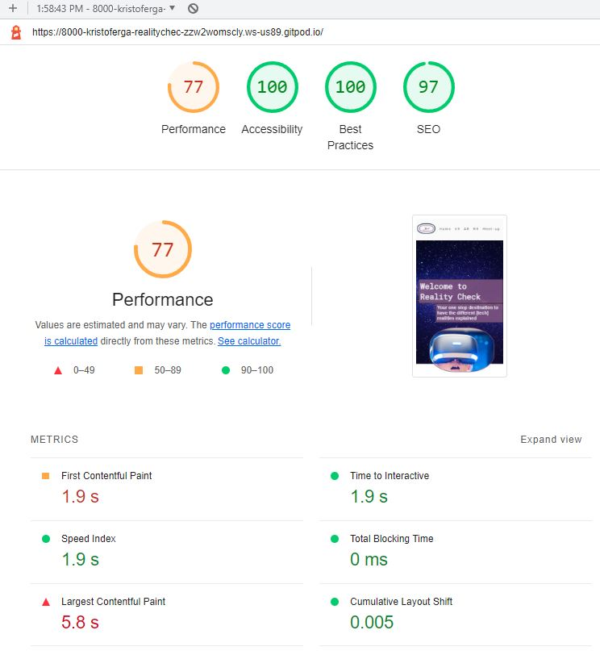

# Reality | Check

Reality Check is your one stop destination for getting all the different tech realities explained in just one page! Our goal is to create a viaualy apealing and simple summary to clairify what VR, AR and MR is all about with pictures, videos and explanatory texts as aid. We target people that does not have much prior knowledge of the subject at hand but are intrested in learning more and has a tech-sence and interest. Since we are conducting weekly meet-ups we try to encourage as many people to join us as possible through our contact form at the end of the page.

## Features 

We have included several features in this one-page website about the different tech realities out there. These features will be categorized in separate titles to enhance its intended use and functions.

### Existing Features

- __Navigation Bar__

  - This navigation bar is fixed at the top of the page and is fully responsive for different screens and will make sure to follow you along as you read through the sites information. It will help link you through the sites different sections Home VR AR MR and ofcourse the Meet-up section.
  - This section will allow the user to easily navigate from page to page across all devices without having to revert back to the previous page via the ‘back’ button. 

- __The landing page__

  - The landing page is welcoming you with a text explaining what the site is all about including a visualy apealing picture of the univers and a image of a child in awe using a VR-headset to strengthen what the sites is for.
  - This section sets the atmosphere and mood through design and images that follow through the rest of the site.

- __Summary Section__

  - This section is a short summary of the three main pillars VR, AR and MR that includes a small image and a text that summarises, with few words, describes their meaning nad use.
  - This will ensure to catch the users interest and they will easeier find which if these categories (if not all) that they wish to continue to read and learn more about. Links are also inkluded to wiki for further reading should this be of interest.

- __Detailed Section__

  - This section goes into more detail about each categorie with more text that explaines its use and purpose. A video is also included for users that are more into visual learning than reading. is a short summary of the three main pillars VR, AR and MR that includes a small image and a text that summarises, with few words, describes their meaning nad use.
  - This is also where the links in the navigations bar will take you.
  - These three detailed sections will ensure to further extend users interest and knowledge about the subjects.
 

- __Meet-up section__

  - This section will allow the user to see exactly when the meet-ups will take place, if there are any requirements for that particular day and where they will be held. 
  - This section will be updated as these times change to keep the user up to date. 

- __Join-In form section__

  - This form is connected to and followed right after the meet-up section to make it fast and simple for interested users to sign up for the different days and topics that fits them. The user will be asked to fill out their name, last name, email adress and what days they would like to Join In on.

- __The Footer__ 

  - The footer section includes links to the relevant social media sites for Reality | Check. The links will open to a new tab to allow easy navigation for the user. 
  - The footer is valuable to the user as it encourages them to keep connected via social media.

### Features Left to Implement

- The detailed section shall in the future be located att the same space on the site with the JavaScript functionality to change information with radio-button choices instead of having to scroll further down.

## __Testing__ 

This website is built for Desktop viewing in mind and is therefor optimized for this purpose. Testing has been done during the developments different stages with lighthouse as a main resource to ensure the best performance possible at the same time as accessibility and best pratices are followed and addherd to. Chrome dev-tools was the main source for designing the site where the Inspect window was constantly being observed to ensure the intended results. On the picture below the result of the finnished website can be viewed after running it through lighthouse one last time before deployment.

While desktop was the focus for the build, media queries have been added to make sure that it works on other devices as well, such as tablet and mobile. Due to the fixed navbar, detaild section, summary section, and to ensure high UX on different sized devices, as many as seven queries were made. It works end responds well on different sizes but is not intended do be used on small mobile devices.

Even if the function is there on mobile devices it loses its performance, mostly due to img sizes optimized for desktop as can be seen on the image below.

After deployment the site has been tested on six different screen sizes with good and functional results:
- Desktop Display hp 24" screen
- Large laptop with 20" screen
- Iphone 11 Pro
- Huawei P20 Pro
- Iphone SE
- Iphone 8

The site is also tested on multiple web browsers:
- Chrome
- Edge
- Firefox
- Safari

### Safari Bugs

After testing on Safari a few bugs were discovered:
- The sites logos innerradius is squared insted of round. This is because the css command outline is not yet released.
- When rotating the scaling of the detailed section is not correct and the iframes overlap underlying section.

### Validator Testing 

- HTML
  - No errors were returned when passing through the official [W3C validator](https://validator.w3.org/nu/?showsource=yes&doc=https%3A%2F%2Fkristofergab.github.io%2Freality-check%2F)
- CSS
  - No errors were found when passing through the official [W3C (Jigsaw) validator](http://jigsaw.w3.org/css-validator/validator?lang=en&profile=css3svg&uri=https%3A%2F%2Fkristofergab.github.io%2Freality-check%2F&usermedium=all&vextwarning=&warning=1)

### Unfixed Bugs

Issues mentioned under testing section related to Safari is yet to be fixed. The outline issue is deemed acceptable. However is the overlaping issue something that has to be handled in future release.

## Deployment

- The site was deployed to GitHub pages. The steps to deploy are as follows: 
  - In the GitHub repository, navigate to the Settings tab 
  - From the source section drop-down menu, select the main Branch
  - Once the main branch has been selected, the page will be automatically refreshed with a detailed ribbon display to indicate the successful deployment. 

The live link can be found here - https://kristofergab.github.io/reality-check/ 

## Credits 

### Content 

In this section all the webpages that where used as help for the development of this site will be listed. First the link to the website will be presented and then the information what the site was used for explained right after the link.

https://www.w3schools.com/css/css3_images.asp
https://www.w3schools.com/css/css3_object-fit.asp
https://www.w3schools.com/css/css_align.asp
for imgages

https://stackoverflow.com/questions/52037809/add-alpha-channel-to-hex-color-declared-on-css-variable
for opacity on hex

https://blog.logrocket.com/how-create-double-border-css/
https://developer.mozilla.org/en-US/docs/Web/CSS/border
for dubble borders

https://www.freecodecamp.org/news/how-to-center-anything-with-css-align-a-div-text-and-more/
for centering div content

https://stackoverflow.com/questions/36337086/my-youtube-video-wont-show-in-iframe
for embedding youtube

https://www.w3schools.com/howto/tryit.asp?filename=tryhow_css_stacked_form
for styling forms

Love Running project
for Times section - copy and modify code for meet up,
and for placement of FA script

https://css-tricks.com/fixed-headers-on-page-links-and-overlapping-content-oh-my/
for fixing fixed navbar scrolldown problem

https://developer.mozilla.org/en-US/docs/Web/Performance/Lazy_loading
for lazy loading

https://fontawesome.com/v4/accessibility/
for area-hidden

https://css-tricks.com/lazy-load-embedded-youtube-videos/
for srcdoc on iframe
Code copied:
`srcdoc="<a href=https://www.youtube.com/embed/Y8Wp3dafaMQ?autoplay=1>▶</a>"`

https://www.w3schools.com/Css/css3_mediaqueries_ex.asp
for hiding img on media query

https://cloudconvert.com/jpg-to-webp
for converting jpg to webp

http://zuga.net/articles/html-heading-elements/
for h3 size in rem

https://www.w3schools.com/css/tryit.asp?filename=trycss_css_image_overlay_opacity
for img hover overlay
copied style code and modified

https://stackoverflow.com/questions/1818249/form-with-no-action-and-where-enter-does-not-reload-page
for form without action javascript
javascript:void(0)

https://medium.com/@aurelien.delogu/401-error-on-a-webmanifest-file-cb9e3678b9f3
for crossreference on favicons to remove 401 error

- The text for the Summary section was taken from Wikipedia:
https://en.wikipedia.org/wiki/Virtual_reality
https://en.wikipedia.org/wiki/Augmented_reality
https://en.wikipedia.org/wiki/Mixed_reality

- The text for the Detailed section was taken from an article written by Robert Sheldon
https://www.techtarget.com/whatis/definition/virtual-reality
for text description in detailed section

- The icons used on the site were all taken from [Font Awesome](https://fontawesome.com/)

### Media

- All images used on the website are from the open source site https://www.pexels.com/ and extra credit given to the photographers kind enough to let us use these images for free:
- Ali Pazani
- Harsch Shivam
- Jessica Lewis Creative
- Michelangelo Buonarroti
- Miriam Espacio
- Moose Photos
- Shvets Production
- Tima Miroshnichenko